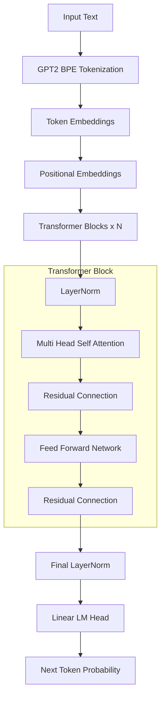
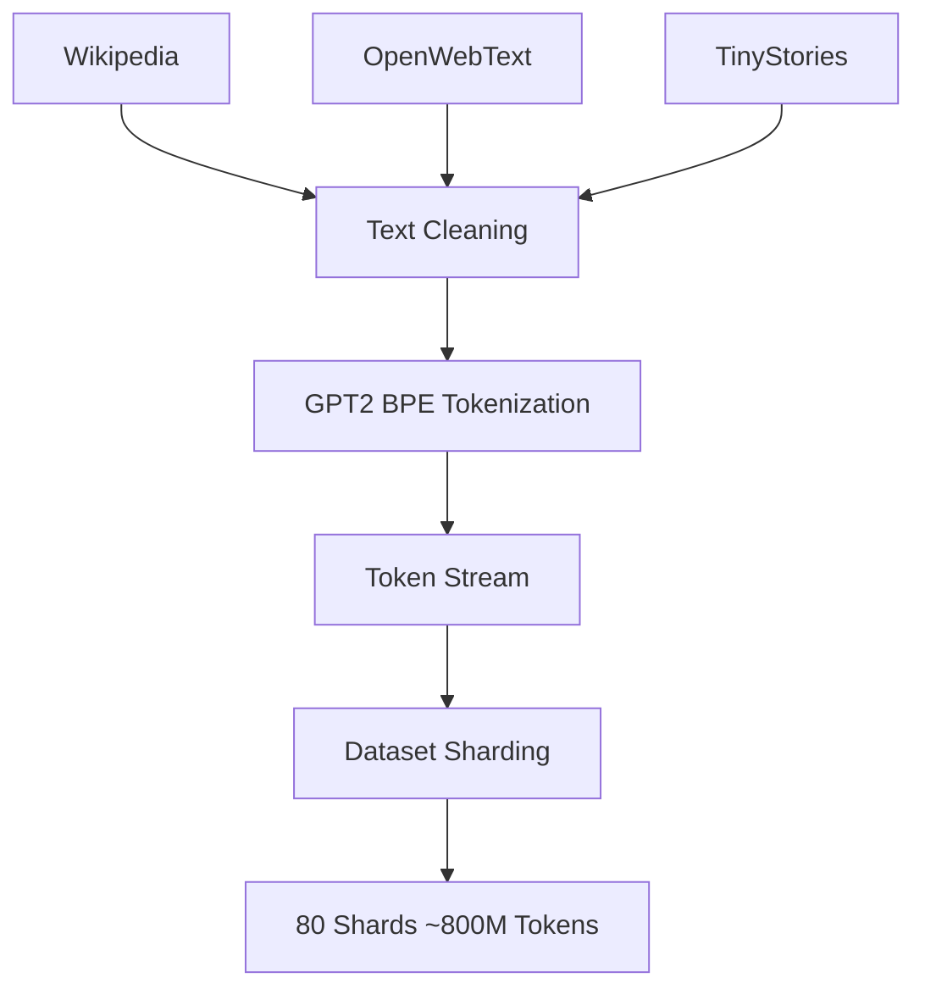

# GPT From Scratch

A GPT-style Transformer language model implemented **from scratch in PyTorch** and trained on ~800M tokens using Google Colab GPUs.

This project was **inspired by Andrej Karpathy's nanoGPT and OpenAI's GPT2**, but the architecture, training pipeline, dataset processing, and evaluation were implemented independently to better understand the mechanics of large language model training.


# Project Goals

The objective of this project was to:

- Understand transformer architectures deeply
- Implement a GPT-style language model from first principles
- Build a full training pipeline
- Train a model on a moderately large dataset (~800M tokens)
- Implement inference and evaluation tools


# Model 

- Decoder-only Transformer
- Causal self-attention
- Multi-head attention
- LayerNorm
- Feed-forward networks

### Model Summary

| Component | Value |
|----------|------|
| Parameters | ~30M |
| Layers | 8 |
| Heads | 8 |
| Embedding Size | 512 |
| Context Length | 256 |
| Tokenizer | GPT-2 BPE (tiktoken) |

Model size was constrained to 30M parameters to fit within free-tier Colab T4 GPU constraints — a deliberate engineering tradeoff.

## Model Architecture




This is essentially the same architecture used in GPT-2 and other autoregressive language models.


# Dataset

The training dataset was constructed from:

- **Wikipedia**
- **OpenWebText**
- **TinyStories**

Total dataset size:

~800 million tokens

Due to hardware constraints, the dataset was sharded into smaller binary files for efficient loading.

## Tokenization

The model uses the **GPT-2 Byte Pair Encoding (BPE) tokenizer** implemented through the `tiktoken` library.

Tokenizer details:

- **Tokenizer:** GPT-2 BPE
- **Vocabulary Size:** ~50,257 tokens
- **Library:** `tiktoken`
- **Encoding:** `gpt2`

Example:
Input text:
Artificial intelligence will transform society

Tokens:
[Artificial, intelligence, will, transform, society] 

The dataset size of **~800M tokens refers to tokens produced by this GPT-2 BPE tokenizer**, not raw words or characters.

## Dataset Pipeline




# Training Setup

Training was performed using:

- **PyTorch**
- **Mixed precision (AMP)**
- **Gradient accumulation**
- **Dataset sharding**
- **Checkpoint recovery**

## Model Configuration

Example configuration used during training:

Layers: 8 |
Embedding Size: 512 |
Attention Heads: 8 |
Context Length: 256 |
Parameters: ~30M

### Hardware

Training was done on:

Google Colab T4 GPUs

Due to the free-tier compute limits, the model size and dataset scale were constrained.


# Results

Final training statistics:

| Metric | Value |
|------|------|
| Training Steps | ~53,000 |
| Dataset Size | ~800M tokens |
| Model Size | ~30M parameters |
| Validation Loss | ~4.63 |
| Perplexity | ~103 |


# Example Generation

Prompt: 

"Artificial Intelligence and Banking are 2 of the most important sectors in human society nowadays along with "

Generated Text:

Artificial Intelligence and Banking are 2 of the most important sectors in human society nowadays along with  an international network, and  an international network.
The International Office for Finance and Housing is a European and International Bank of Technology established by the Ministry of Industry, for the work of the Ministry of Health and Environment. 
In May 2005, the Ministry of Public Radio was renamed the International Bank of Energy in October 2006.
In October 2006, the Ministry of Internal Affairs of the Ministry of Internal Affairs of the Ministry of Land in the Ministry of Internal Affairs in the Ministry of Internal Affairs in the Ministry of Internal Affairs.


# Running Training
```bash
python training/train.py
```

Training automatically resumes from the latest checkpoint.


# Text Generation
```bash
python inference/generate.py \
--checkpoint /content/drive/MyDrive/gpt_checkpoints/ckpt_53000.pt \
--prompt "Artificial Intelligence and Banking are 2 of the most important sectors in human society nowadays along with "
```


# Evaluation
```bash
python evaluation/perplexity.py
```


# Acknowledgements

This project was **inspired by Andrej Karpathy's nanoGPT and OpenAI's GPT2**, which served as a conceptual reference for understanding GPT training pipelines.

However, the code in this repository was **implemented independently from scratch** as part of a learning exercise.


# License

MIT License
